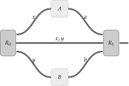

Lower Bounds on the Quantum Value of a Two-Player Nonlocal Game
================================================================

A *two-player nonlocal game* consists of players that we give the names *Alice*
and *Bob*:

   The players: Alice and Bob.

Alice and Bob are in separate locations and cannot communicate once the game
begins. Prior to the game however, Alice and Bob are free to communicate with
each other. In addition to the players, there is also another party in this
game that is referred to as the *referee*.

.. figure:: figures/referee.svg
   :alt: nonlocal game
   :align: center

   The referee.

Alice and Bob want to play in a cooperative fashion against the referee.

Now that we have set the stage with respect to the actors and actresses we will
encounter in this game, let us see how the game is actually played.

   A two-player nonlocal game.

A nonlocal game unfolds in the following manner.

1. The referee randomly generates questions denoted as :math:`x` and :math:`y`.
   The referee sends the question :math:`x` to Alice and the question :math:`y`
   to Bob. The referee also keeps a copy of :math:`x` and :math:`y` for
   reference.

2. Alice and Bob each receive their respective questions. They are then each
   expected to respond to their questions with answers that we denote as
   :math:`a` and :math:`b`. Alice sends :math:`a` to the referee, and Bob sends
   :math:`b`.

3. When the referee receives :math:`a` and :math:`b` from Alice and Bob, the
   referee evaluates a particular function that is predicated on the questions
   :math:`x` and :math:`y` as well as the answers :math:`a` and :math:`b`. The
   outcome of this function is either :math:`0` or :math:`1`, where an outcome
   of :math:`0` indicates a loss for Alice and Bob and an outcome of :math:`1`
   indicates a win for Alice and Bob.

Alice and Bob's goal in the above game is to get the function in Step-3 to
output a :math:`1`, or equivalently, to indicate a winning outcome. This type
of game is referred to as a *nonlocal game*.

Classical and Quantum Strategies
--------------------------------

Now that we have the framework for a nonlocal game, we can consider the
player's *strategy*; how the players play the game given access to certain
resources. There are a number of strategies that the players can use, but for
simplicity, we will restrict our attention to two types of strategies.

1. *Classical strategies*: The players answer the questions in a deterministic
   manner.

2. *Quantum strategies*: The players make use of quantum resources in the form
   of a shared quantum state and respective sets of measurements.

