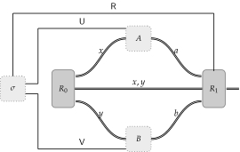

Extended Nonlocal Games
==========================

In this tutorial, we will define the concept of an *extended nonlocal game*.
Extended nonlocal games are a more general abstraction of nonlocal games
wherein the referee, who previously only provided questions and answers to the
players, now share a state with the players and is able to perform a
measurement on that shared state. 

Every extended nonlocal game has a *value* associated to it. Analogously to
nonlocal games, this value is a quantity that dictates how well the players can
perform a task in the extended nonlocal game model when given access to certain
resources. We will be using :code:`toqito` to calculate these quantities.

We will also look at existing results in the literature on these values and be
able to replicate them using :code:`toqito`. Much of the written content in
this tutorial will be directly taken from [tRusso17]_.

Extended nonlocal games have a natural physical interpretation in the setting
of tripartite steering [tCSAN15]_ and in device-independent quantum scenarios [tTFKW13]_. For
more information on extended nonlocal games, please refer to [tJMRW16]_ and
[tRusso17]_.

The extended nonlocal game model
--------------------------------

An *extended nonlocal game* is similar to a nonlocal game in the sense that it
is a cooperative game played between two players Alice and Bob against a
referee. The game begins much like a nonlocal game, with the referee selecting
and sending a pair of questions :math:`(x,y)` according to a fixed probability
distribution. Once Alice and Bob receive :math:`x` and :math:`y`, they respond
with respective answers :math:`a` and :math:`b`. Unlike a nonlocal game, the
outcome of an extended nonlocal game is determined by measurements performed by
the referee on its share of the state initially provided to it by Alice and
Bob. 

   An extended nonlocal game.

Specifically, Alice and Bob's winning probability is determined by a
collections of measurements, :math:`V(a,b|x,y) \in \text{Pos}(\mathcal{R})`,
where :math:`\mathcal{R} = \mathbb{C}^m` is a complex Euclidean space with
:math:`m` denoting the dimension of the referee's quantum system--so if Alice
and Bob's response :math:`(a,b)` to the question pair :math:`(x,y)` leaves the
referee's system in the quantum state

.. math::
    \sigma_{a,b}^{x,y} \in \text{D}(\mathcal{R}),

then their winning and losing probabilities are given by

.. math::
    \left\langle V(a,b|x,y), \sigma_{a,b}^{x,y} \right\rangle 
    \quad \text{and} \quad 
    \left\langle \mathbb{I} - V(a,b|x,y), \sigma_{a,b}^{x,y} \right\rangle.

Strategies for extended nonlocal games
---------------------------------------

An extended nonlocal game :math:`G` is defined by a pair :math:`(\pi, V)`,
where :math:`\pi` is a probability distribution of the form

.. math::
    \pi : \Sigma_A \times \Sigma_B \rightarrow [0, 1]

on the Cartesian product of two alphabets :math:`\Sigma_A` and
:math:`\Sigma_B`, and :math:`V` is a function of the form

.. math::
    V : \Gamma_A \times \Gamma_B \times \Sigma_A \times \Sigma_B \rightarrow \text{Pos}(\mathcal{R})

for :math:`\Sigma_A` and :math:`\Sigma_B` as above, :math:`\Gamma_A` and
:math:`\Gamma_B` being alphabets, and :math:`\mathcal{R}` refers to the
referee's space. Just as in the case for nonlocal games, we shall use the
convention that

.. math::
    \Sigma = \Sigma_A \times \Sigma_B \quad \text{and} \quad \Gamma = \Gamma_A \times \Gamma_B

to denote the respective sets of questions asked to Alice and Bob and the sets
of answers sent from Alice and Bob to the referee.

When analyzing a strategy for Alice and Bob, it may be convenient to define a
function

.. math::
    K : \Gamma_A \times \Gamma_B \times \Sigma_A \times \Sigma_B \rightarrow \text{Pos}(\mathcal{R}).

We can represent Alice and Bob's winning probability for an extended nonlocal
game as

.. math::
    \sum_{(x,y) \in \Sigma} \pi(x,y) \sum_{(a,b) \in \Gamma} \left\langle V(a,b|x,y), K(a,b|x,y) \right\rangle.

Unentangled strategies for extended nonlocal games
^^^^^^^^^^^^^^^^^^^^^^^^^^^^^^^^^^^^^^^^^^^^^^^^^^^

An *unentangled strategy* for an extended nonlocal game is simply a standard
quantum strategy for which the state :math:`\sigma \in \text{D}(\mathcal{U}
\otimes \mathcal{R} \otimes \mathcal{V})` initially prepared by Alice and Bob
is fully separable. 

Any unentangled strategy is equivalent to a strategy where Alice and Bob store
only classical information after the referee's quantum system has been provided
to it.

For a given extended nonlocal game :math:`G = (\pi, V)` we write
:math:`\omega(G)` to denote the *unentangled value* of :math:`G`, which is the
supremum value for Alice and Bob's winning probability in :math:`G` over all
unentangled strategies. The unentangled value of any extended nonlocal game,
:math:`G`, may be written as

.. math::
    \omega(G) = \max_{f, g}
    \lVert
    \sum_{(x,y) \in \Sigma_A \times \Sigma_B} \pi(x,y)
    V(f(x), g(y)|x, y)
    \rVert

where the maximum is over all functions :math:`f : \Sigma_A \rightarrow
\Gamma_A` and :math:`g : \Sigma_B \rightarrow \Gamma_B`.

Standard quantum strategies for extended nonlocal games
^^^^^^^^^^^^^^^^^^^^^^^^^^^^^^^^^^^^^^^^^^^^^^^^^^^^^^^^
(Coming soon)

Non-signaling strategies for extended nonlocal games
^^^^^^^^^^^^^^^^^^^^^^^^^^^^^^^^^^^^^^^^^^^^^^^^^^^^^

A *non-signaling strategy* for an extended nonlocal game consists of a function

.. math::
    K : \Gamma_A \times \Gamma_B \times \Sigma_A \times \Sigma_B \rightarrow \text{Pos}(\mathcal{R})

such that

.. math::
    \sum_{a \in \Gamma_A} K(a,b|x,y) = \rho_b^y \quad \text{and} \quad \sum_{b \in \Gamma_B} K(a,b|x,y) = \sigma_a^x,

for all :math:`x \in \Sigma_A` and :math:`y \in \Sigma_B` where
:math:`\{\rho_b^y : y \in \Sigma_B, b \in \Gamma_B\}` and :math:`\{\sigma_a^x:
x \in \Sigma_A, a \in \Gamma_A\}` are collections of operators satisfying

.. math::
    \sum_{a \in \Gamma_A} \sigma_a^x = \tau = \sum_{b \in \Gamma_B} \rho_b^y,

for every choice of :math:`x \in \Sigma_A` and :math:`y \in \Sigma_B` and where
:math:`\tau \in \text{D}(\mathcal{R})` is a density operator.

For any extended nonlocal game, :math:`G = (\pi, V)`, the winning probability
for a non-signaling strategy is given by

.. math::
    \sum_{(x,y) \in \Sigma} \pi(x,y) \sum_{(a,b) \in \Gamma} \left\langle V(a,b|x,y) K(a,b|x,y) \right\rangle.

We denote the *non-signaling value* of :math:`G` as :math:`\omega_{ns}(G)`
which is the supremum value of the winning probability of :math:`G` taken over
all non-signaling strategies for Alice and Bob.

Relationships between different strategies and values
^^^^^^^^^^^^^^^^^^^^^^^^^^^^^^^^^^^^^^^^^^^^^^^^^^^^^

For an extended nonlocal game, :math:`G`, the values have the following relationship:

.. note::
    .. math::
        0 \leq \omega(G) \leq \omega^*(G) \leq \omega_{ns}(G) \leq 1.

Example: The BB84 extended nonlocal game
-----------------------------------------

The BB84 game is defined as follows. Let :math:`\Sigma_A = \Sigma_B = \Gamma_A
= \Gamma_B = \{0,1\}`, define

.. math::
    \begin{equation}
        \begin{aligned}
            V(0,0|0,0) = \begin{pmatrix}
                            1 & 0 \\
                            0 & 0
                         \end{pmatrix}, &\quad
            V(1,1|0,0) = \begin{pmatrix}
                            0 & 0 \\
                            0 & 1
                         \end{pmatrix}, \\
            V(0,0|1,1) = \frac{1}{2}\begin{pmatrix}
                            1 & 1 \\
                            1 & 1
                         \end{pmatrix}, &\quad
            V(1,1|1,1) = \frac{1}{2}\begin{pmatrix}
                            1 & -1 \\
                            -1 & 1
                         \end{pmatrix},
        \end{aligned}
    \end{equation}

define 

.. math::
    V(a,b|x,y) = \begin{pmatrix} 0 & 0 \\ 0 & 0 \end{pmatrix}

for all :math:`a \not= b` or :math:`x \not= y`, define :math:`\pi(0,0) =
\pi(1,1) = 1/2`, and define :math:`\pi(x,y) = 0` if :math:`x \not=y`.

We can encode the BB84 game, :math:`G_{BB84} = (\pi, V)`, in :code:`numpy`
arrays where :code:`prob_mat` corresponds to the probability distribution
:math:`\pi` and where :code:`pred_mat` corresponds to the operator :math:`V`. 

.. code-block:: python
    
    >>> """Define the BB84 extended nonlocal game."""
    >>> import numpy as np
    >>> from toqito.states import basis
    >>>
    >>> # The basis: {|0>, |1>}:
    >>> e_0, e_1 = basis(2, 0), basis(2, 1)
    >>>
    >>> # The basis: {|+>, |->}:
    >>> e_p = (e_0 + e_1) / np.sqrt(2)
    >>> e_m = (e_0 - e_1) / np.sqrt(2)
    >>>
    >>> # The dimension of referee's measurement operators:
    >>> dim = 2
    >>> # The number of outputs for Alice and Bob:
    >>> a_out, b_out = 2, 2
    >>> # The number of inputs for Alice and Bob:
    >>> a_in, b_in = 2, 2
    >>> 
    >>> # Define the predicate matrix V(a,b|x,y) \in Pos(R)
    >>> bb84_pred_mat = np.zeros([dim, dim, a_out, b_out, a_in, b_in])
    >>>
    >>> # V(0,0|0,0) = |0><0|
    >>> bb84_pred_mat[:, :, 0, 0, 0, 0] = e_0 * e_0.conj().T
    >>> # V(1,1|0,0) = |1><1|
    >>> bb84_pred_mat[:, :, 1, 1, 0, 0] = e_1 * e_1.conj().T
    >>> # V(0,0|1,1) = |+><+|
    >>> bb84_pred_mat[:, :, 0, 0, 1, 1] = e_p * e_p.conj().T
    >>> # V(1,1|1,1) = |-><-|
    >>> bb84_pred_mat[:, :, 1, 1, 1, 1] = e_m * e_m.conj().T
    >>>
    >>> # The probability matrix encode \pi(0,0) = \pi(1,1) = 1/2
    >>> bb84_prob_mat = 1/2*np.identity(2)

The unentangled value of the BB84 extended nonlocal game
^^^^^^^^^^^^^^^^^^^^^^^^^^^^^^^^^^^^^^^^^^^^^^^^^^^^^^^^^^^^^^^^^

.. code-block:: python

    >>> """Calculate the unentangled value of the BB84 extended nonlocal game."""
    >>> from toqito.nonlocal_games.extended_nonlocal_game import ExtendedNonlocalGame
    >>> 
    >>> # Define an ExtendedNonlocalGame object based on the BB84 game.
    >>> bb84 = ExtendedNonlocalGame(bb84_prob_mat, bb84_pred_mat)
    >>> 
    >>> # The unentangled value is cos(pi/8)**2 \approx 0.85356
    >>> bb84.unentangled_value() 
    0.8535533905544173

.. code-block:: python

    >>> """The unentangled value of BB84 under parallel repetition."""
    >>> from toqito.nonlocal_games.extended_nonlocal_game import ExtendedNonlocalGame
    >>> 
    >>> # Define the bb84 game for two parallel repetitions.
    >>> bb84_2_reps = ExtendedNonlocalGame(bb84_prob_mat, bb84_pred_mat, 2)
    >>> 
    >>> # The unentangled value for two parallel repetitions is cos(pi/8)**4 \approx 0.72855
    >>> bb84_2_reps.unentangled_value() 
    0.7285533940730632

The standard quantum value of the BB84 extended nonlocal game
^^^^^^^^^^^^^^^^^^^^^^^^^^^^^^^^^^^^^^^^^^^^^^^^^^^^^^^^^^^^^^^^^^^^
(Coming soon).

The non-signaling value of the BB84 extended nonlocal game
^^^^^^^^^^^^^^^^^^^^^^^^^^^^^^^^^^^^^^^^^^^^^^^^^^^^^^^^^^^^^^^^^^^^

.. code-block:: python

    >>> """Calculate the non-signaling value of the BB84 extended nonlocal game."""
    >>> from toqito.nonlocal_games.extended_nonlocal_game import ExtendedNonlocalGame
    >>> 
    >>> # Define an ExtendedNonlocalGame object based on the BB84 game.
    >>> bb84 = ExtendedNonlocalGame(bb84_prob_mat, bb84_pred_mat)
    >>> 
    >>> # The non-signaling value is cos(pi/8)**2 \approx 0.85356
    >>> bb84.nonsignaling_value() 
    0.853486975032519

It turns out that strong parallel repetition does *not* hold in the
non-signaling scenario for the BB84 game. We can observe this by the following
snippet.

.. code-block:: python

    >>> """The non-signaling value of BB84 under parallel repetition."""
    >>> from toqito.nonlocal_games.extended_nonlocal_game import ExtendedNonlocalGame
    >>> 
    >>> # Define the bb84 game for two parallel repetitions.
    >>> bb84_2_reps = ExtendedNonlocalGame(bb84_prob_mat, bb84_pred_mat, 2)
    >>> 
    >>> # The non-signaling value for two parallel repetitions is cos(pi/8)**4 \approx 0.73825
    >>> bb84_2_reps.nonsignaling_value() 
    0.7382545498689419

Note that :math:`0.73825 \geq \cos(\pi/8)**4 \approx 0.72855` and therefore we
have that

.. math::
    \omega_{ns}(G^r_{BB84}) \not= \omega_{ns}(G_{BB84})^r

for :math:`r = 2`.

Example: The CHSH extended nonlocal game
-----------------------------------------

Let us now define another extended nonlocal game, :math:`G_{CHSH}`.

Let :math:`\Sigma_A = \Sigma_B = \Gamma_A = \Gamma_B = \{0,1\}`, define a
collection of measurements :math:`\{V(a,b|x,y) : a \in \Gamma_A, b \in
\Gamma_B, x \in \Sigma_A, y \in \Sigma_B\} \subset \text{Pos}(\mathcal{R})`
such that

.. math::
    \begin{equation}
        \begin{aligned}
            V(0,0|0,0) = V(0,0|0,1) = V(0,0|1,0) = \begin{pmatrix}
                                                    1 & 0 \\
                                                    0 & 0
                                                   \end{pmatrix}, \\
            V(1,1|0,0) = V(1,1|0,1) = V(1,1|1,0) = \begin{pmatrix}
                                                    0 & 0 \\
                                                    0 & 1
                                                   \end{pmatrix}, \\
            V(0,1|1,1) = \frac{1}{2}\begin{pmatrix}
                                        1 & 1 \\
                                        1 & 1
                                    \end{pmatrix}, \\
            V(1,0|1,1) = \frac{1}{2} \begin{pmatrix}
                                        1 & -1 \\
                                        -1 & 1
                                     \end{pmatrix},
        \end{aligned}
    \end{equation}

define 

.. math::
    V(a,b|x,y) = \begin{pmatrix} 0 & 0 \\ 0 & 0 \end{pmatrix}

for all :math:`a \oplus b \not= x \land y`, and define :math:`\pi(0,0) =
\pi(0,1) = \pi(1,0) = \pi(1,1) = 1/4`.

In the event that :math:`a \oplus b \not= x \land y`, the referee's measurement
corresponds to the zero matrix. If instead it happens that :math:`a \oplus b =
x \land y`, the referee then proceeds to measure with respect to one of the
measurement operators. This winning condition is reminiscent of the standard
CHSH nonlocal game.

We can encode :math:`G_{CHSH}` in a similar way using :code:`numpy` arrays as
we did for :math:`G_{BB84}`.

.. code-block:: python

    >>> """Define the CHSH extended nonlocal game."""
    >>> import numpy as np
    >>>
    >>> # The dimension of referee's measurement operators:
    >>> dim = 2
    >>> # The number of outputs for Alice and Bob:
    >>> a_out, b_out = 2, 2
    >>> # The number of inputs for Alice and Bob:
    >>> a_in, b_in = 2, 2
    >>> 
    >>> # Define the predicate matrix V(a,b|x,y) \in Pos(R)
    >>> chsh_pred_mat = np.zeros([dim, dim, a_out, b_out, a_in, b_in])
    >>>
    >>> # V(0,0|0,0) = V(0,0|0,1) = V(0,0|1,0).
    >>> chsh_pred_mat[:, :, 0, 0, 0, 0] = np.array([[1, 0], [0, 0]])
    >>> chsh_pred_mat[:, :, 0, 0, 0, 1] = np.array([[1, 0], [0, 0]])
    >>> chsh_pred_mat[:, :, 0, 0, 1, 0] = np.array([[1, 0], [0, 0]])
    >>>
    >>> # V(1,1|0,0) = V(1,1|0,1) = V(1,1|1,0).
    >>> chsh_pred_mat[:, :, 1, 1, 0, 0] = np.array([[0, 0], [0, 1]])
    >>> chsh_pred_mat[:, :, 1, 1, 0, 1] = np.array([[0, 0], [0, 1]])
    >>> chsh_pred_mat[:, :, 1, 1, 1, 0] = np.array([[0, 0], [0, 1]])
    >>>
    >>> # V(0,1|1,1)
    >>> chsh_pred_mat[:, :, 0, 1, 1, 1] = 1/2 * np.array([[1, 1], [1, 1]])
    >>>
    >>> # V(1,0|1,1)
    >>> chsh_pred_mat[:, :, 1, 0, 1, 1] = 1/2 * np.array([[1, -1], [-1, 1]])
    >>>
    >>> # The probability matrix encode \pi(0,0) = \pi(0,1) = \pi(1,0) = \pi(1,1) = 1/4.
    >>> chsh_prob_mat = np.array([[1/4, 1/4], [1/4, 1/4]])

Example: The unentangled value of the CHSH extended nonlocal game
^^^^^^^^^^^^^^^^^^^^^^^^^^^^^^^^^^^^^^^^^^^^^^^^^^^^^^^^^^^^^^^^^

.. code-block:: python

    >>> """Calculate the unentangled value of the CHSH extended nonlocal game."""
    >>> from toqito.nonlocal_games.extended_nonlocal_game import ExtendedNonlocalGame
    >>> 
    >>> # Define an ExtendedNonlocalGame object based on the CHSH game.
    >>> chsh = ExtendedNonlocalGame(chsh_prob_mat, chsh_pred_mat)
    >>> 
    >>> # The unentangled value is 3/4 = 0.75
    >>> chsh.unentangled_value() 
    0.7499999999992315

.. code-block:: python

    >>> """The unentangled value of CHSH under parallel repetition."""
    >>> from toqito.nonlocal_games.extended_nonlocal_game import ExtendedNonlocalGame
    >>> 
    >>> # Define the CHSH game for two parallel repetitions.
    >>> chsh_2_reps = ExtendedNonlocalGame(chsh_prob_mat, chsh_pred_mat, 2)
    >>> 
    >>> # The unentangled value for two parallel repetitions is (3/4)**2 \approx 05625
    >>> chsh_2_reps.unentangled_value() 
    0.5625000000002018

Example: The non-signaling value of the CHSH extended nonlocal game
^^^^^^^^^^^^^^^^^^^^^^^^^^^^^^^^^^^^^^^^^^^^^^^^^^^^^^^^^^^^^^^^^^^^

.. code-block:: python

    >>> """Calculate the non-signaling value of the CHSH extended nonlocal game."""
    >>> from toqito.nonlocal_games.extended_nonlocal_game import ExtendedNonlocalGame
    >>> 
    >>> # Define an ExtendedNonlocalGame object based on the CHSH game.
    >>> chsh = ExtendedNonlocalGame(chsh_prob_mat, chsh_pred_mat)
    >>> 
    >>> # The non-signaling value is 3/4 = 0.75
    >>> chsh.nonsignaling_value() 
    0.7500002249607216

As we know that :math:`\omega(G_{CHSH}) = \omega_{ns}(G_{CHSH}) = 3/4` and that

.. math::
    \omega(G) \leq \omega^*(G) \omega_{ns}(G)

for any extended nonlocal game, :math:`G`, we may also conclude that
:math:`\omega^*(G) = 3/4`.

Example: An extended nonlocal game with quantum advantage
----------------------------------------------------------

Example: A monogamy-of-entanglement game with mutually unbiased bases
^^^^^^^^^^^^^^^^^^^^^^^^^^^^^^^^^^^^^^^^^^^^^^^^^^^^^^^^^^^^^^^^^^^^^^

References
------------------------------

.. [tJMRW16] Johnston, Nathaniel, Mittal, Rajat, Russo, Vincent, Watrous, John
    "Extended non-local games and monogamy-of-entanglement games"
    Proceedings of the Royal Society A: Mathematical, Physical and Engineering Sciences 472.2189 (2016),
    https://arxiv.org/abs/1510.02083

.. [tCSAN15] Cavalcanti, Daniel, Skrzypczyk, Paul, Aguilar, Gregory, Nery, Ranieri
    "Detection of entanglement in asymmetric quantum networks and multipartite quantum steering"
    Nature Communications, 6(7941), 2015
    https://arxiv.org/abs/1412.7730

.. [tTFKW13] Tomamichel, Marco, Fehr, Serge, Kaniewski, Jkedrzej, and Wehner, Stephanie.
    "A Monogamy-of-Entanglement Game With Applications to Device-Independent Quantum Cryptography"
    New Journal of Physics 15.10 (2013): 103002,
    https://arxiv.org/abs/1210.4359

.. [tRusso17] Russo, Vincent
    "Extended nonlocal games"
    https://arxiv.org/abs/1704.07375

