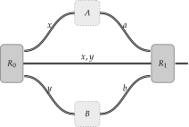

Lower Bounds on the Quantum Value of a Two-Player Nonlocal Game
================================================================

A *two-player nonlocal game* consists of players that we give the names *Alice*
and *Bob*:

.. figure:: figures/alice_and_bob.svg
   :alt: nonlocal game
   :align: center

   The players: Alice and Bob.

Alice and Bob are in separate locations and cannot communicate once the game
begins. Prior to the game however, Alice and Bob are free to communicate with
each other. In addition to the players, there is also another party in this
game that is referred to as the *referee*.

.. figure:: figures/referee.svg
   :alt: nonlocal game
   :align: center

   The referee.

Alice and Bob want to play in a cooperative fashion against the referee.

Now that we have set the stage with respect to the actors and actresses we will
encounter in this game, let us see how the game is actually played.

   A two-player nonlocal game.

A nonlocal game unfolds in the following manner.

1. The referee randomly generates questions denoted as :math:`x` and :math:`y`.
   The referee sends the question :math:`x` to Alice and the question :math:`y`
   to Bob. The referee also keeps a copy of :math:`x` and :math:`y` for
   reference.

2. Alice and Bob each receive their respective questions. They are then each
   expected to respond to their questions with answers that we denote as
   :math:`a` and :math:`b`. Alice sends :math:`a` to the referee, and Bob sends
   :math:`b`.

3. When the referee receives :math:`a` and :math:`b` from Alice and Bob, the
   referee evaluates a particular function that is predicated on the questions
   :math:`x` and :math:`y` as well as the answers :math:`a` and :math:`b`. The
   outcome of this function is either :math:`0` or :math:`1`, where an outcome
   of :math:`0` indicates a loss for Alice and Bob and an outcome of :math:`1`
   indicates a win for Alice and Bob.

Alice and Bob's goal in the above game is to get the function in Step-3 to
output a :math:`1`, or equivalently, to indicate a winning outcome. This type
of game is referred to as a *nonlocal game*.

Classical and Quantum Strategies
--------------------------------

Now that we have the framework for a nonlocal game, we can consider the
player's *strategy*; how the players play the game given access to certain
resources. There are a number of strategies that the players can use, but for
simplicity, we will restrict our attention to two types of strategies.

1. *Classical strategies*: The players answer the questions in a deterministic
   manner.

2. *Quantum strategies*: The players make use of quantum resources in the form
   of a shared quantum state and respective sets of measurements.

Classical strategies
^^^^^^^^^^^^^^^^^^^^

A *classical strategy* for a nonlocal game is one where the players
deterministically produce an output for every possible combination of inputs
they may receive in the game. The *classical value* of a nonlocal game is the
maximum probability achieved by the players over all classical strategies. For
a nonlocal game, :math:`G`, we use :math:`\omega(G)` to represent the classical
value of :math:`G`.

One question you may have is whether a classical strategy can be improved by
introducing randomness. If the players randomly select their answers, is it
possible for them to do potentially better than if they had just played
deterministically? As it happens, probabilistic classical strategies cannot
perform any better than deterministic classical strategies.

There is therefore no loss in generality in restricting our analysis of
classical strategies to deterministic ones and it is assumed that when we use
the term classical strategy that we implicitly mean a classical strategy that
is played deterministically.

Quantum strategies
^^^^^^^^^^^^^^^^^^

A *quantum strategy* for a nonlocal game is one where the players prepare a
quantum state prior to the start of the game along with respective sets of
measurements that they apply to their respective portions of the shared state
during the game based on the questions they receive to generate their answers.
The *quantum value* of a nonlocal game is the maximum probability achieved by
the players over all quantum strategies. For a nonlocal game, math:`G`, we use
:math:`\omega^*(G)` to represent the quantum value of :math:`G`.

   A two-player nonlocal game invoking a quantum strategy.

Let us describe the high-level steps for how Alice and Bob play using a quantum
strategy.

1. Alice and Bob prepare a state :math:`\sigma \in \text{D}(\mathcal{U} \otimes
   \mathcal{V})` prior to the start of the game. We use :math:`\textsf{U}`` and
   :math:`\textsf{V}` to denote the respective registers of spaces :math:`\textsf{U}`
   and :math:`\textsf{V}`.

2. The referee sends question :math:`x \in \Sigma_A` to Alice and :math:`y \in
   \Sigma_B` to Bob. 

3. Alice and Bob perform a *measurement* on their system. The outcome of this
   measurement yields their answers :math:`a \in \Gamma_A` and :math:`b \in
   \Gamma_B`. Specifically, Alice and Bob have collections of measurements

.. math::
    \begin{equation}
        \begin{aligned}
            \{ A_a^x : a \in \Gamma_{\text{A}} \} \subset \text{Pos}(\mathcal{U})
            \quad \text{and} \quad 
            \{ B_b^y : b \in \Gamma_{\text{B}} \} \subset \text{Pos}(\mathcal{V}),
        \end{aligned}
    \end{equation}

such that the measurements satisfy

.. math::
    \begin{equation}
        \begin{aligned}
            \sum_{a \in \Gamma_A} A_a^x = \mathbb{I}_{\mathcal{U}}
            \quad \text{and} \quad 
            \sum_{b \in \Gamma_B} B_b^y = \mathbb{I}_{\mathcal{V}}
        \end{aligned}
    \end{equation}

4. The referee determines whether Alice and Bob win or lose, based on the
   questions :math:`x` and :math:`y` as well as the answers :math:`a` and
   :math:`b`. 

For certain games, the probability that the players obtain a winning outcome is
higher if they use a quantum strategy as opposed to a classical one. This
striking separation is one primary motivation to study nonlocal games, as it
provides examples of tasks that benefit from the manipulation of quantum
information. 

Calculating the quantum value
--------------------------------
