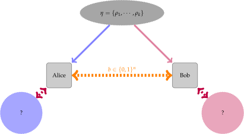

Quantum state distinguishability
=================================

In this tutorial we are going to cover the problem of *quantum state
distinguishability* (sometimes analogously referred to as quantum state
discrimination). We are going to briefly describe the problem setting and then
describe how one may use :code:`|toqito⟩` to calculate the optimal probability
with which this problem can be solved when given access to certain
measurements.

Further information beyond the scope of this tutorial can be found in the text
:cite:`Watrous_2018_TQI` as well as the course :cite:`Sikora_2019_Semidefinite`.

The state distinguishability problem
-------------------------------------

The quantum state distinguishability problem is phrased as follows.

1. Alice possesses an ensemble of :math:`n` quantum states:

    .. math::
        \begin{equation}
            \eta = \left( (p_0, \rho_0), \ldots, (p_n, \rho_n)  \right),
        \end{equation}

where :math:`p_i` is the probability with which state :math:`\rho_i` is
selected from the ensemble. Alice picks :math:`\rho_i` with probability
:math:`p_i` from her ensemble and sends :math:`\rho_i` to Bob.

2. Bob receives :math:`\rho_i`. Both Alice and Bob are aware of how the
   ensemble is defined but he does *not* know what index :math:`i`
   corresponding to the state :math:`\rho_i` he receives from Alice is.

3. Bob wants to guess which of the states from the ensemble he was given. In
   order to do so, he may measure :math:`\rho_i` to guess the index :math:`i`
   for which the state in the ensemble corresponds.

This setting is depicted in the following figure.

   The quantum state distinguishability setting.

Depending on the sets of measurements that Alice and Bob are allowed to use,
the optimal probability of distinguishing a given set of states is characterized
by the following image.

.. figure:: figures/measurement_inclusions.svg
   :width: 200
   :alt: measurement hierarchy
   :align: center

   Measurement hierarchy.

That is,the probability that Alice and Bob are able to distinguish using PPT
measurements is a natural upper bound on the optimal probability of
distinguishing via separable measurements.

In general:

* LOCC: These are difficult objects to handle mathematically; difficult to
  design protocols for and difficult to provide bounds on their power.

* Separable: Separable measurements have a nicer structure than LOCC.
  Unfortunately, optimizing over separable measurements in NP-hard.

* PPT: PPT measurements offer a nice structure and there exists efficient
  techniques that allow one to optimize over the set of PPT measurements via
  semidefinite programming.

Optimal probability of distinguishing a quantum state
^^^^^^^^^^^^^^^^^^^^^^^^^^^^^^^^^^^^^^^^^^^^^^^^^^^^^

The optimal probability with which Bob can distinguish the state he is given
may be obtained by solving the following semidefinite program (SDP).

.. math::
    \begin{align*}
        \text{maximize:} \quad & \sum_{i=0}^n p_i \langle M_i,
        \rho_i \rangle \\
        \text{subject to:} \quad & \sum_{i=0}^n M_i = \mathbb{I}_{\mathcal{X}},\\
                                 & M_i \in \text{Pos}(\mathcal{X}).
    \end{align*}

This optimization problem is solved in :code:`|toqito⟩` to obtain the optimal
probability with which Bob can distinguish state :math:`\rho_i`.

To illustrate how we can phrase and solve this problem in :code:`|toqito⟩`,
consider the following example. Assume Alice has an ensemble of quantum states

.. math::
    \eta = \{ (1/2, \rho_0), (1/2, \rho_1) \}

such that 

.. math::
    \rho_0 = | 0 \rangle \langle 0 | = \begin{pmatrix}
                1 & 0 \\
                0 & 0
             \end{pmatrix} \quad \text{and} \quad
    \rho_1 = | 1 \rangle \langle 1 | = \begin{pmatrix}
                0 & 0 \\
                0 & 1
             \end{pmatrix}.

These states are completely orthogonal to each other, and it is known that Bob
can optimally distinguish the state he is given perfectly, i.e. with probability
:math:`1`.

Using :code:`|toqito⟩`, we can calculate this probability directly as follows:

.. code-block:: python

    >>> import numpy as np
    >>> from toqito.states import basis
    >>> from toqito.state_opt import state_distinguishability
    >>> 
    >>> # Define the standard basis |0> and |1>
    >>> e_0, e_1 = basis(2, 0), basis(2, 1)
    >>>
    >>> # Define the corresponding density matrices of |0> and |1> 
    >>> # given as |0><0| and |1><1|, respectively.
    >>> e_00 = e_0 @ e_0.conj().T
    >>> e_11 = e_1 @ e_1.conj().T
    >>>
    >>> # Define a list of states and a corresponding list of 
    >>> # probabilities with which those states are selected.
    >>> states = [e_00, e_11] 
    >>> probs = [1/2, 1/2]
    >>>
    >>> # Calculate the probability with which Bob can 
    >>> # distinguish the state he is provided.
    >>> np.around(state_distinguishability(states, probs)[0], decimals=2)
    np.float64(1.0)

Specifying similar state distinguishability problems can be done so using this
general pattern.

.. _ref-label-state-dist-ppt:

Optimal probability of distinguishing a state via PPT measurements
^^^^^^^^^^^^^^^^^^^^^^^^^^^^^^^^^^^^^^^^^^^^^^^^^^^^^^^^^^^^^^^^^^

We may consider the quantum state distinguishability scenario under somewhat
different and more limited set of circumstances. Specifically, we may want to
ask the same question but restrict to enforcing that in order to determine the
state that Bob is provided, he is limited to using a certain class of
measurement. There are a wider class of measurements with respect to the ones
we considered in the previous example referred to as PPT (positive partial
transpose).

The problem of state distinguishability with respect to PPT measurements can
also be framed as an SDP and was initially presented in this manner in
:cite:`Cosentino_2013_PPT`

.. math::

    \begin{equation}
        \begin{aligned}
            \text{minimize:} \quad & \frac{1}{k} \text{Tr}(Y) \\
            \text{subject to:} \quad & Y \geq \text{T}_{\mathcal{A}}
                                      (\rho_j), \quad j = 1, \ldots, k, \\
                                     & Y \in \text{Herm}(\mathcal{A} \otimes
                                      \mathcal{B}).
        \end{aligned}
    \end{equation}

Using :code:`|toqito⟩`, we can determine the optimal probability for Bob to
distinguish a given state from an ensemble if he is only given access to PPT
measurements.

Consider the following Bell states

.. math::
    \begin{equation}
        \begin{aligned}
            | \psi_0 \rangle = \frac{|00\rangle + |11\rangle}{\sqrt{2}}, &\quad
            | \psi_1 \rangle = \frac{|01\rangle + |10\rangle}{\sqrt{2}}, \\
            | \psi_2 \rangle = \frac{|01\rangle - |10\rangle}{\sqrt{2}}, &\quad
            | \psi_3 \rangle = \frac{|00\rangle - |11\rangle}{\sqrt{2}}.
        \end{aligned}
    \end{equation}

It was shown in :cite:`Cosentino_2013_PPT` and later extended in :cite:`Cosentino_2014_Small` that for the following set of states

.. math::
    \begin{equation}
        \begin{aligned}
            \rho_1^{(2)} &= |\psi_0 \rangle | \psi_0 \rangle \langle \psi_0 | \langle \psi_0 |, \quad
            \rho_2^{(2)} &= |\psi_1 \rangle | \psi_3 \rangle \langle \psi_1 | \langle \psi_3 |, \\
            \rho_3^{(2)} &= |\psi_2 \rangle | \psi_3 \rangle \langle \psi_2 | \langle \psi_3 |, \quad
            \rho_4^{(2)} &= |\psi_3 \rangle | \psi_3 \rangle \langle \psi_3 | \langle \psi_3 |, \\
        \end{aligned}
    \end{equation}

that the optimal probability of distinguishing via a PPT measurement should yield
:math:`7/8 \approx 0.875`.

This ensemble of states and some of its properties with respect to
distinguishability were initially considered in :cite:`Yu_2012_Four`. In :code:`|toqito⟩`,
we can calculate the probability with which Bob can distinguish these states
via PPT measurements in the following manner.

.. code-block:: python

    >>> import numpy as np
    >>> from toqito.states import bell
    >>> from toqito.state_opt import ppt_distinguishability
    >>> # Bell vectors:
    >>> psi_0 = bell(0)
    >>> psi_1 = bell(2)
    >>> psi_2 = bell(3)
    >>> psi_3 = bell(1)
    >>>
    >>> # YDY vectors from :cite:`Yu_2012_Four`:
    >>> x_1 = np.kron(psi_0, psi_0)
    >>> x_2 = np.kron(psi_1, psi_3)
    >>> x_3 = np.kron(psi_2, psi_3)
    >>> x_4 = np.kron(psi_3, psi_3)
    >>>
    >>> # YDY density matrices:
    >>> rho_1 = x_1 @ x_1.conj().T
    >>> rho_2 = x_2 @ x_2.conj().T
    >>> rho_3 = x_3 @ x_3.conj().T
    >>> rho_4 = x_4 @ x_4.conj().T
    >>>
    >>> states = [rho_1, rho_2, rho_3, rho_4]
    >>> probs = [1 / 4, 1 / 4, 1 / 4, 1 / 4]
    >>> np.around(ppt_distinguishability(vectors=states, probs=probs, dimensions=[2, 2, 2, 2], subsystems=[0, 2])[0], decimals=2)
    np.float64(0.87)

Probability of distinguishing a state via separable measurements
^^^^^^^^^^^^^^^^^^^^^^^^^^^^^^^^^^^^^^^^^^^^^^^^^^^^^^^^^^^^^^^^^^

As previously mentioned, optimizing over the set of separable measurements is
NP-hard. However, there does exist a hierarchy of semidefinite programs which
eventually does converge to the separable value. This hierarchy is based off
the notion of symmetric extensions. More information about this hierarchy of
SDPs can be found here :cite:`Navascues_2008_Pure`.

References
------------------------------

.. bibliography:: 
    :filter: docname in docnames

.. .. [tWatrousQI] Watrous, John
..     "The theory of quantum information"
..     Section: "A semidefinite program for optimal measurements"
..     Cambridge University Press, 2018

.. .. [tNav08] Navascués, Miguel.
..     "Pure state estimation and the characterization of entanglement."
..     Physical review letters 100.7 (2008): 070503.
..     https://arxiv.org/abs/0707.4398

.. .. [tSikoraSDP] Sikora, Jamie
..     "Semidefinite programming in quantum theory (lecture series)"
..     Lecture 2: Semidefinite programs for nice problems and popular functions
..     Perimeter Institute for Theoretical Physics, 2019

.. .. [tCosentino13] Cosentino, Alessandro,
..     "Positive-partial-transpose-indistinguishable states via semidefinite programming",
..     Physical Review A 87.1 (2013): 012321.
..     https://arxiv.org/abs/1205.1031

.. .. [tCR13] Cosentino, Alessandro and Russo, Vincent
..     "Small sets of locally indistinguishable orthogonal maximally entangled states",
..     Quantum Information & Computation, Volume 14, 
..     https://arxiv.org/abs/1307.3232

.. .. [tYDY12] Yu, Nengkun, Runyao Duan, and Mingsheng Ying.
..     "Four locally indistinguishable ququad-ququad orthogonal
..     maximally entangled states."
..     Physical review letters 109.2 (2012): 020506.
..     https://arxiv.org/abs/1107.3224
