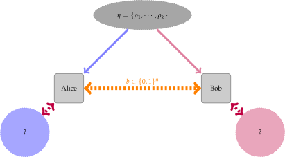
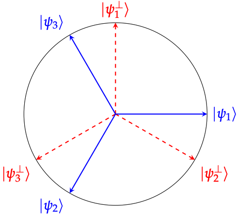

Quantum state exclusion
=======================

In this tutorial, we are going to cover the problem of *quantum state
exclusion*. We are going to briefly describe the problem setting and then
describe how one may use :code:`toqito` to calculate the optimal probability
with which this problem can be solved for a number of different scenarios.

Quantum state exclusion is very closely related to the problem of quantum state
distinguishability. It may be useful to consult the following tutorial that
covers quantum state distinguishability:

* `Quantum State Distinguishability <https://toqito.readthedocs.io/en/latest/tutorials.state_distinguishability.html>`_

Further information beyond the scope of this tutorial can be found in the text
:cite:`Pusey_2012_On` as well as the course :cite:`Bandyopadhyay_2014_Conclusive`.

The state exclusion problem
---------------------------

The quantum state exclusion problem is phrased as follows.

1. Alice possesses an ensemble of :math:`n` quantum states:

    .. math::
        \begin{equation}
            \eta = \left( (p_0, \rho_0), \ldots, (p_n, \rho_n)  \right),
        \end{equation}

where :math:`p_i` is the probability with which state :math:`\rho_i` is
selected from the ensemble. Alice picks :math:`\rho_i` with probability
:math:`p_i` from her ensemble and sends :math:`\rho_i` to Bob.

2. Bob receives :math:`\rho_i`. Both Alice and Bob are aware of how the
   ensemble is defined but he does *not* know what index :math:`i`
   corresponding to the state :math:`\rho_i` he receives from Alice is.

3. Bob wants to guess which of the states from the ensemble he was *not* given.
   In order to do so, he may measure :math:`\rho_i` to guess the index
   :math:`i` for which the state in the ensemble corresponds.

This setting is depicted in the following figure.

   The quantum state exclusion setting.

.. note::
    The primary difference between the quantum state distinguishability
    scenario and the quantum state exclusion scenario is that in the former,
    Bob want to guess which state he was given, and in the latter, Bob wants to
    guess which state he was *not* given.

Perfect state exclusion (antidistinguishability)
------------------------------------------------

We say that if one is able to perfectly (without error) exclude all quantum states in a set, then the set of states is
*antidistinguishable*.

**Definition**: Let :math:`n` and :math:`d` be integers. A collection of quantum states :math:`S = \{|\psi_1\rangle, \ldots, |\psi_{n}\rangle\} \subset \mathbb{C}^d` 
are *antidistinguishable* if there exists a collection of positive operator value measurements :math:`\{M_1, \ldots, M_{n}\}` such that :math:`\langle \psi_i | M_i | \psi_i \rangle = 0` 
for all :math:`1 \leq i \leq n`. 

Recall that a collection of POVMs are positive semidefinite operators 
:math:`\{M_i : 1 \leq i \leq n\} \subset \mathbb{C}^d` that satisfy 

.. math::
    \begin{equation}
        \sum_{i=1}^{n} M_i = \mathbb{I}_{d}.
    \end{equation}

**Properties**:

* If :math:`S` is distinguishable then it is antidistinguishable.

* If :math:`n = 2` then :math:`S` is distinguishable if and only if :math:`S` is antidistinguishable.

    * Distinguishing one state from a pair of states is equivalent to excluding one of the states from that pair.

* If :math:`n \geq 3` then there are antidistinguishable sets that are not distinguishable.

Example: Trine states
^^^^^^^^^^^^^^^^^^^^^

The so-called *trine states* are a set of three states, each of dimension two defined as

.. math::
    \begin{equation}
        |\psi_1\rangle = |0\rangle, \quad
        |\psi_2\rangle = -\frac{1}{2}(|0\rangle + \sqrt{3}|1\rangle), \quad
        |\psi_3\rangle = -\frac{1}{2}(|0\rangle - \sqrt{3}|1\rangle).
    \end{equation}

.. code-block:: python

    >>> from toqito.states import trine
    >>> psi1, psi2, psi3 = trine()
    >>> print(f"|𝛙_1> = {psi1.reshape(1, -1)[0]}")
    |𝛙_1> = [1 0]
    >>> print(f"|𝛙_2> = {psi2.reshape(1, -1)[0]}")
    |𝛙_2> = [-0.5       -0.8660254]
    >>> print(f"|𝛙_3> = {psi3.reshape(1, -1)[0]}")
    |𝛙_3> = [-0.5        0.8660254]

The trine states are three states in two dimensions. So they can't be mutually orthogonal, but they are about "as close
as you can get" for three states in two dimensions to be mutually orthogonal.

.. code-block:: python

    >>> from toqito.states import trine
    >>> from toqito.state_props import is_mutually_orthogonal
    >>> print(f"Are states mutually orthogonal: {is_mutually_orthogonal(trine())}")
    Are states mutually orthogonal: False

An interesting property of these states is that they are antidistinguishable but *not* distinguishable. 

.. code-block:: python

    >>> from toqito.states import trine
    >>> from toqito.state_props import is_distinguishable, is_antidistinguishable
    >>> print(f"Trine antidistinguishable: {is_antidistinguishable(trine())}")
    Trine antidistinguishable: True
    >>> print(f"Trine distinguishable: {is_distinguishable(trine())}")
    Trine distinguishable: False

Here are a set of measurements that we can verify which satisfy the antidistinguishability constraints. We will see a
method that we can use to obtain these directly later. 

.. math::
    \begin{equation}
        M_1 = \frac{2}{3} (\mathbb{I} - |\psi_1\rangle \langle \psi_1|), \quad
        M_2 = \frac{2}{3} (\mathbb{I} - |\psi_2\rangle \langle \psi_2|), \quad
        M_3 = \frac{2}{3} (\mathbb{I} - |\psi_3\rangle \langle \psi_3|).
    \end{equation}

.. code-block:: python

    >>> import numpy as np
    >>> M1 = 2/3 * (np.identity(2) - psi1 @ psi1.conj().T)
    >>> M2 = 2/3 * (np.identity(2) - psi2 @ psi2.conj().T)
    >>> M3 = 2/3 * (np.identity(2) - psi3 @ psi3.conj().T)

In order for :math:`M_1`, :math:`M_2`, and :math:`M_3` to constitute as valid POVMs, each of these matrices must be
positive semidefinite and we must ensure that :math:`\sum_{i \in \{1,2,3\}} M_i = \mathbb{I}_2`.

.. code-block:: python

    >>> from toqito.matrix_props import is_positive_semidefinite
    >>> print(f"M_1 + M_2 + M_3 is identity: {np.allclose(M1 + M2 + M3, np.identity(2))}")
    M_1 + M_2 + M_3 is identity: True
    >>> print(f"Is M_1 PSD: {is_positive_semidefinite(M1)}")
    Is M_1 PSD: True
    >>> print(f"Is M_2 PSD: {is_positive_semidefinite(M2)}")
    Is M_2 PSD: True
    >>> print(f"Is M_3 PSD: {is_positive_semidefinite(M3)}")
    Is M_3 PSD: True

Next, we must show that these measurements satisfy :math:`\langle \psi_i | M_i | \psi_i \rangle = 0` 
for all :math:`i \in \{1,2,3\}`.

.. code-block:: python

    >>> print(f"<𝛙_1| M_1 |𝛙_1>: {np.around((psi1.reshape(1, -1)[0] @ M1 @ psi1)[0], decimals=5)}")
    <𝛙_1| M_1 |𝛙_1>: 0.0
    >>> print(f"<𝛙_2| M_2 |𝛙_2>: {np.around((psi2.reshape(1, -1)[0] @ M2 @ psi2)[0], decimals=5)}")
    <𝛙_2| M_2 |𝛙_2>: 0.0
    >>> print(f"<𝛙_3| M_3 |𝛙_3>: {np.around((psi3.reshape(1, -1)[0] @ M3 @ psi3)[0], decimals=5)}")
    <𝛙_3| M_3 |𝛙_3>: 0.0

Since we have exhibited a set of measurements :math:`\{M_i: i \in \{1,2,3\}\} \subset \text{Pos}(\mathbb{C^d})` that satisfy

.. math::
    \begin{equation}
        \langle \psi_i | M_i | \psi_i \rangle = 0 
        \quad \text{and} \quad
        \sum_{i \in \{1,2,3\}} M_i = \mathbb{I}_2
    \end{equation}

for all :math:`i`, we conclude that the trine states are antidistinguishable.

An SDP for antidistinguishability
^^^^^^^^^^^^^^^^^^^^^^^^^^^^^^^^^

Whether a collection of states :math:`\{|\psi_1 \rangle, |\psi_2\rangle, \ldots, |\psi_{n}\rangle \}` are antidistinguishable
or not can be determined by the following semidefinite program (SDP).

.. math::
    \begin{equation}
        \begin{aligned}
            \text{minimize:} \quad & \sum_{i=1}^{n} \langle \psi_i | M_i | \psi_i \rangle  \\
            \text{subject to:} \quad & \sum_{i=1}^{n} M_i = \mathbb{I}_{\mathcal{X}}, \\
                                     & M_i \succeq 0 \quad \forall \ 1 \leq i \leq n.
        \end{aligned}
    \end{equation}

Consider again the trine states from the previous example. We can determine that they are antidistinguishable by way of
the antidistinguishability SDP. 

.. code-block:: python

    >>> from toqito.states import trine
    >>> from toqito.state_opt import state_exclusion
    >>> opt_value, measurements = state_exclusion(trine(), probs=[1, 1, 1], primal_dual="dual")
    >>> print(f"Optimal SDP value: {np.around(opt_value, decimals=2)}")
    Optimal SDP value: 0.0

The SDP not only gives us the optimal value, which is $0$ in this case, indicating that the states are
antidistinguishable, but we also get a set of optimal measurement operators. These should look familiar to the
measurements we explicitly constructed earlier.

References
------------------------------

.. bibliography:: 
    :filter: docname in docnames
