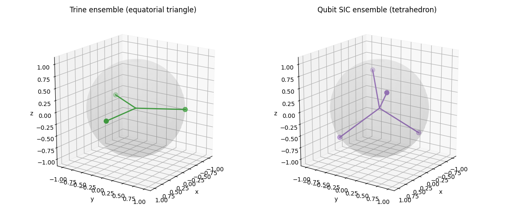

<!--
 DO NOT EDIT.
 THIS FILE WAS AUTOMATICALLY GENERATED BY mkdocs-gallery.
 TO MAKE CHANGES, EDIT THE SOURCE PYTHON FILE:
 "content/examples/05_geometric_QSD/geometric_qsd_geometry.py"
 LINE NUMBERS ARE GIVEN BELOW.
-->

!!! note

    Click [here](#download_links)
    to download the full example code

# Geometric QSD: trine and tetrahedral state geometry

<!-- GENERATED FROM PYTHON SOURCE LINES 3-12 -->

## Geometric QSD

Geometry-first visualizations of two symmetric qubit ensembles:

- trine states (equatorial triangle),
- SIC tetrahedron (regular tetrahedron).

The side-by-side Bloch plots highlight how state arrangement influences
distinguishability.

<!-- GENERATED FROM PYTHON SOURCE LINES 12-17 -->

```{.python }

import matplotlib.pyplot as plt
import numpy as np


```


<!-- GENERATED FROM PYTHON SOURCE LINES 18-19 -->

## Helper functions

<!-- GENERATED FROM PYTHON SOURCE LINES 19-52 -->

```{.python }


def plot_bloch_vectors(
    vectors: np.ndarray,
    title: str = "Bloch vectors",
    ax: plt.Axes | None = None,
    color: str = "tab:blue",
) -> plt.Axes:
    """Draw Bloch sphere and vectors."""
    if ax is None:
        fig = plt.figure(figsize=(6, 6))
        ax = fig.add_subplot(111, projection="3d")

    u = np.linspace(0, 2 * np.pi, 60)
    v = np.linspace(0, np.pi, 30)
    x = np.outer(np.cos(u), np.sin(v))
    y = np.outer(np.sin(u), np.sin(v))
    z = np.outer(np.ones_like(u), np.cos(v))
    ax.plot_surface(x, y, z, alpha=0.12, color="lightgray", linewidth=0)

    vectors = np.asarray(vectors, dtype=float)
    for vec in vectors:
        ax.plot([0, vec[0]], [0, vec[1]], [0, vec[2]], color=color, lw=2)
    ax.scatter(vectors[:, 0], vectors[:, 1], vectors[:, 2], color=color, s=60)

    ax.set_xlabel("x")
    ax.set_ylabel("y")
    ax.set_zlabel("z")
    ax.set_box_aspect((1, 1, 1))
    ax.set_title(title)
    return ax


```


<!-- GENERATED FROM PYTHON SOURCE LINES 53-54 -->

Trine states on the equator.

<!-- GENERATED FROM PYTHON SOURCE LINES 54-71 -->

```{.python }
angles = np.array([0, 2 * np.pi / 3, 4 * np.pi / 3])
trine = np.stack([np.cos(angles), np.sin(angles), np.zeros_like(angles)], axis=1)

# Qubit SIC tetrahedral vectors.
tetra = np.array([[1, 1, 1], [1, -1, -1], [-1, 1, -1], [-1, -1, 1]], dtype=float) / np.sqrt(3)

fig = plt.figure(figsize=(12, 5))
ax1 = fig.add_subplot(121, projection="3d")
plot_bloch_vectors(trine, title="Trine ensemble (equatorial triangle)", ax=ax1, color="tab:green")
ax1.view_init(elev=18, azim=35)

ax2 = fig.add_subplot(122, projection="3d")
plot_bloch_vectors(tetra, title="Qubit SIC ensemble (tetrahedron)", ax=ax2, color="tab:purple")
ax2.view_init(elev=18, azim=35)

plt.tight_layout()
plt.show()
```


{: .mkd-glr-single-img srcset="../images/mkd_glr_geometric_qsd_geometry_001.png"}

Out:
{: .mkd-glr-script-out }

```{.shell .mkd-glr-script-out-disp }
/Users/kawayip/toqito_private_notebook/mkdocs/content/examples/05_geometric_QSD/geometric_qsd_geometry.py:70: UserWarning: FigureCanvasAgg is non-interactive, and thus cannot be shown
  plt.show()

```


**Total running time of the script:** ( 0 minutes  0.622 seconds)

<div id="download_links"></div>


[:fontawesome-solid-download: Download Python source code: geometric_qsd_geometry.py](./geometric_qsd_geometry.py){ .md-button .center}

[:fontawesome-solid-download: Download Jupyter notebook: geometric_qsd_geometry.ipynb](./geometric_qsd_geometry.ipynb){ .md-button .center}


[Gallery generated by mkdocs-gallery](https://smarie.github.io/mkdocs-gallery){: .mkd-glr-signature }
