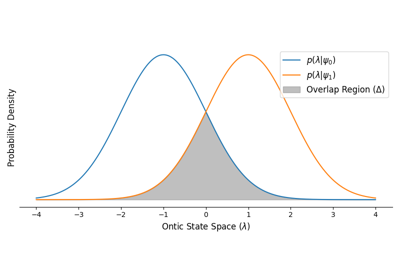
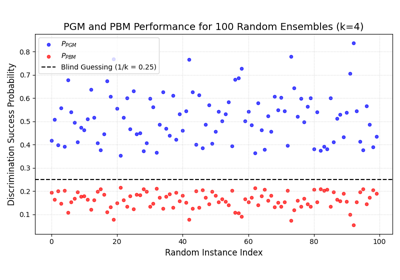

# Examples

This gallery demonstrates how to utilize the functionality in `|toqito⟩`. 

<!-- content_generated_gallery -->

## Basic Tutorials

The following rendered tutorials demonstrate introductory concepts:

    <!--div class="figure align-default" id="id1"-->
        
        

            
                <a class="reference internal" href="basics/superdense_coding">
                    Superdense Coding
                </a>
            
            <!--a class="headerlink" href="#id1" title="Permalink to this image"></a-->
        

    <!--/div-->

    <!--div class="figure align-default" id="id1"-->
        
        

            
                <a class="reference internal" href="basics/intro_tutorial">
                    Introductory Tutorial
                </a>
            
            <!--a class="headerlink" href="#id1" title="Permalink to this image"></a-->
        

    <!--/div-->

<!-- content_generated_gallery_basics -->

# Quantum States

- Quantum state distinguishability
- Quantum state exclusion
- Quantum classification, factor width, k-incoherence
- Antidistinguishability of Circulant States and the Eigenvalue Criterion
- Equiangular States and the Antidistinguishability Threshold
- The Pretty Good and Pretty Bad Measurements
- he Pusey-Barrett-Rudolph (PBR) Theorem

    <!--div class="figure align-default" id="id1"-->
        
        

            
                <a class="reference internal" href="quantum_states/state_distinguishability">
                    Quantum state distinguishability
                </a>
            
            <!--a class="headerlink" href="#id1" title="Permalink to this image"></a-->
        

    <!--/div-->

    <!--div class="figure align-default" id="id1"-->
        
        

            
                <a class="reference internal" href="quantum_states/pbr_theorem">
                    The Pusey-Barrett-Rudolph (PBR) Theorem
                </a>
            
            <!--a class="headerlink" href="#id1" title="Permalink to this image"></a-->
        

    <!--/div-->

    <!--div class="figure align-default" id="id1"-->
        
        

            
                <a class="reference internal" href="quantum_states/circulant_states">
                    Antidistinguishability of Circulant States and the Eigenvalue Criterion
                </a>
            
            <!--a class="headerlink" href="#id1" title="Permalink to this image"></a-->
        

    <!--/div-->

    <!--div class="figure align-default" id="id1"-->
        
        

            
                <a class="reference internal" href="quantum_states/state_exclusion">
                    Quantum state exclusion
                </a>
            
            <!--a class="headerlink" href="#id1" title="Permalink to this image"></a-->
        

    <!--/div-->

    <!--div class="figure align-default" id="id1"-->
        
        

            
                <a class="reference internal" href="quantum_states/classification">
                    Quantum classification, factor width, $k$-incoherence
                </a>
            
            <!--a class="headerlink" href="#id1" title="Permalink to this image"></a-->
        

    <!--/div-->

    <!--div class="figure align-default" id="id1"-->
        
        

            
                <a class="reference internal" href="quantum_states/equiangular_threshold">
                    Equiangular States and the Antidistinguishability Threshold
                </a>
            
            <!--a class="headerlink" href="#id1" title="Permalink to this image"></a-->
        

    <!--/div-->

    <!--div class="figure align-default" id="id1"-->
        
        

            
                <a class="reference internal" href="quantum_states/pgm_pbm">
                    The Pretty Good and Pretty Bad Measurements
                </a>
            
            <!--a class="headerlink" href="#id1" title="Permalink to this image"></a-->
        

    <!--/div-->

<!-- content_generated_gallery_quantum_states -->

[Gallery generated by mkdocs-gallery](https://smarie.github.io/mkdocs-gallery){: .mkd-glr-signature }
