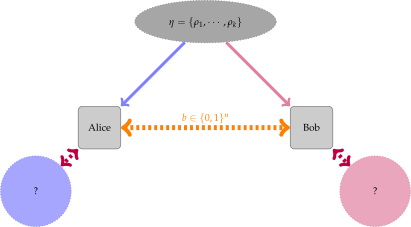
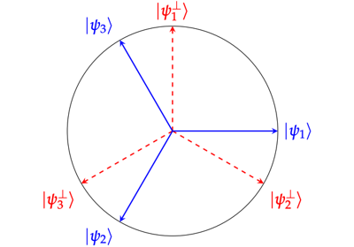
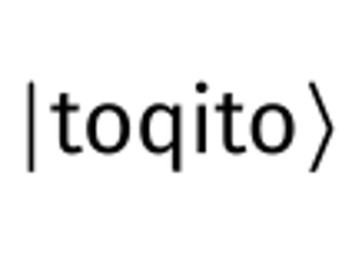
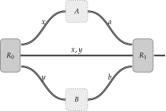
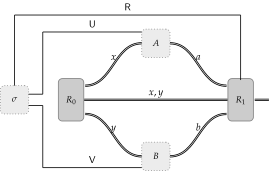
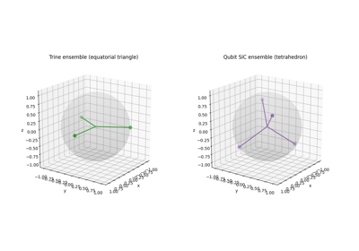

# Examples

This gallery demonstrates how to utilize the functionality in `|toqito⟩`. 

<!-- content_generated_gallery -->

## Basic Tutorials

The following rendered tutorials demonstrate introductory concepts:

- [Introductory Tutorial](../gallery/basics/intro_tutorial.md)
- [Superdense Coding](../gallery/basics/superdense_coding.md)

    <!--div class="figure align-default" id="id1"-->
        
        

            
                <a class="reference internal" href="01_basics/superdense_coding">
                    Superdense Coding
                </a>
            
            <!--a class="headerlink" href="#id1" title="Permalink to this image"></a-->
        

    <!--/div-->

    <!--div class="figure align-default" id="id1"-->
        
        

            
                <a class="reference internal" href="01_basics/intro_tutorial">
                    Introductory Tutorial
                </a>
            
            <!--a class="headerlink" href="#id1" title="Permalink to this image"></a-->
        

    <!--/div-->

<!-- content_generated_gallery_01_basics -->

## Quantum States

The following tutorials cover quantum state analysis:

- [Quantum state distinguishability](../gallery/quantum_states/state_distinguishability)
- [Quantum state exclusion](../generated/quantum_states/state_exclusion)
- [Quantum classification, factor width, k-incoherence](../gallery/quantum_states/classification)
- [Antidistinguishability of Circulant States and the Eigenvalue Criterion](../gallery/quantum_states/circulant_states)
- [Equiangular States and the Antidistinguishability Threshold](../gallery/quantum_states/equiangular_threshold)
- [The Pretty Good and Pretty Bad Measurements](../gallery/quantum_states/pgm_pbm)
- [The Pusey-Barrett-Rudolph (PBR) Theorem](../gallery/quantum_states/pbr_theorem)

    <!--div class="figure align-default" id="id1"-->
        
        

            
                <a class="reference internal" href="02_quantum_states/state_distinguishability">
                    Quantum state distinguishability
                </a>
            
            <!--a class="headerlink" href="#id1" title="Permalink to this image"></a-->
        

    <!--/div-->

    <!--div class="figure align-default" id="id1"-->
        
        

            
                <a class="reference internal" href="02_quantum_states/pbr_theorem">
                    The Pusey-Barrett-Rudolph (PBR) Theorem
                </a>
            
            <!--a class="headerlink" href="#id1" title="Permalink to this image"></a-->
        

    <!--/div-->

    <!--div class="figure align-default" id="id1"-->
        
        

            
                <a class="reference internal" href="02_quantum_states/circulant_states">
                    Antidistinguishability of Circulant States and the Eigenvalue Criterion
                </a>
            
            <!--a class="headerlink" href="#id1" title="Permalink to this image"></a-->
        

    <!--/div-->

    <!--div class="figure align-default" id="id1"-->
        
        

            
                <a class="reference internal" href="02_quantum_states/state_exclusion">
                    Quantum state exclusion
                </a>
            
            <!--a class="headerlink" href="#id1" title="Permalink to this image"></a-->
        

    <!--/div-->

    <!--div class="figure align-default" id="id1"-->
        
        

            
                <a class="reference internal" href="02_quantum_states/equiangular_threshold">
                    Equiangular States and the Antidistinguishability Threshold
                </a>
            
            <!--a class="headerlink" href="#id1" title="Permalink to this image"></a-->
        

    <!--/div-->

    <!--div class="figure align-default" id="id1"-->
        
        

            
                <a class="reference internal" href="02_quantum_states/classification">
                    Quantum classification, factor width, k-incoherence
                </a>
            
            <!--a class="headerlink" href="#id1" title="Permalink to this image"></a-->
        

    <!--/div-->

    <!--div class="figure align-default" id="id1"-->
        
        

            
                <a class="reference internal" href="02_quantum_states/pgm_pbm">
                    The Pretty Good and Pretty Bad Measurements
                </a>
            
            <!--a class="headerlink" href="#id1" title="Permalink to this image"></a-->
        

    <!--/div-->

<!-- content_generated_gallery_02_quantum_states -->

## Nonlocal Games

The following tutorials cover nonlocal game theory:

- [Nonlocal games](../gallery/nonlocal_games/nonlocal_game)
- [Calculating the quantum and classical value of a two-player XOR game](../gallery/nonlocal_games/xor_quantum_value)

    <!--div class="figure align-default" id="id1"-->
        
        

            
                <a class="reference internal" href="03_nonlocal_games/xor_quantum_value">
                    Calculating the quantum and classical value of a two-player XOR game
                </a>
            
            <!--a class="headerlink" href="#id1" title="Permalink to this image"></a-->
        

    <!--/div-->

    <!--div class="figure align-default" id="id1"-->
        
        

            
                <a class="reference internal" href="03_nonlocal_games/nonlocal_game">
                    Nonlocal games
                </a>
            
            <!--a class="headerlink" href="#id1" title="Permalink to this image"></a-->
        

    <!--/div-->

<!-- content_generated_gallery_03_nonlocal_games -->

## Extended Nonlocal Games

The following tutorials cover extended nonlocal game theory:

- [Extended nonlocal games](../gallery/extended_nonlocal_games/enlg_introduction)
- [An extended nonlocal game with quantum advantage](../gallery/extended_nonlocal_games/enlg_mub)
- [The BB84 extended nonlocal game](../gallery/extended_nonlocal_games/enlg_bb84)
- [The CHSH extended nonlocal game](../gallery/extended_nonlocal_games/enlg_chsh)
- [Modeling Bit Commitment Binding Failure](../gallery/extended_nonlocal_games/bit_commitment)

    <!--div class="figure align-default" id="id1"-->
        
        

            
                <a class="reference internal" href="04_extended_nonlocal_games/enlg_introduction">
                    Extended nonlocal games
                </a>
            
            <!--a class="headerlink" href="#id1" title="Permalink to this image"></a-->
        

    <!--/div-->

    <!--div class="figure align-default" id="id1"-->
        
        

            
                <a class="reference internal" href="04_extended_nonlocal_games/bit_commitment">
                    Modeling Bit Commitment Binding Failure
                </a>
            
            <!--a class="headerlink" href="#id1" title="Permalink to this image"></a-->
        

    <!--/div-->

    <!--div class="figure align-default" id="id1"-->
        
        

            
                <a class="reference internal" href="04_extended_nonlocal_games/enlg_mub">
                    An extended nonlocal game with quantum advantage
                </a>
            
            <!--a class="headerlink" href="#id1" title="Permalink to this image"></a-->
        

    <!--/div-->

    <!--div class="figure align-default" id="id1"-->
        
        

            
                <a class="reference internal" href="04_extended_nonlocal_games/enlg_chsh">
                    The CHSH extended nonlocal game
                </a>
            
            <!--a class="headerlink" href="#id1" title="Permalink to this image"></a-->
        

    <!--/div-->

    <!--div class="figure align-default" id="id1"-->
        
        

            
                <a class="reference internal" href="04_extended_nonlocal_games/enlg_bb84">
                    The BB84 extended nonlocal game
                </a>
            
            <!--a class="headerlink" href="#id1" title="Permalink to this image"></a-->
        

    <!--/div-->

<!-- content_generated_gallery_04_extended_nonlocal_games -->

## Geometric Quantum State Discrimination

The following tutorials cover geometric approaches to quantum state discrimination:

- [SIC-POVM intuition and discrimination with toqito](../gallery/geometric_QSD/sic_povm_intuition)
- [Geometric QSD: trine and tetrahedral state geometry](../gallery/geometric_QSD/geometric_qsd_geometry)
- [Geometric QSD performance comparison: optimal SDP vs PGM](../gallery/geometric_QSD/geometric_qsd_performance_comparison)
- [Geometric QSD animation: Bloch-angle sweep for binary discrimination](../gallery/geometric_QSD/geometric_qsd_animation)

    <!--div class="figure align-default" id="id1"-->
        
        

            
                <a class="reference internal" href="05_geometric_QSD/geometric_qsd_geometry">
                    Geometric QSD: trine and tetrahedral state geometry
                </a>
            
            <!--a class="headerlink" href="#id1" title="Permalink to this image"></a-->
        

    <!--/div-->

    <!--div class="figure align-default" id="id1"-->
        
        

            
                <a class="reference internal" href="05_geometric_QSD/geometric_qsd_performance_comparison">
                    Geometric QSD performance comparison: optimal SDP vs PGM
                </a>
            
            <!--a class="headerlink" href="#id1" title="Permalink to this image"></a-->
        

    <!--/div-->

    <!--div class="figure align-default" id="id1"-->
        
        

            
                <a class="reference internal" href="05_geometric_QSD/sic_povm_intuition">
                    SIC-POVM intuition and discrimination with toqito
                </a>
            
            <!--a class="headerlink" href="#id1" title="Permalink to this image"></a-->
        

    <!--/div-->

    <!--div class="figure align-default" id="id1"-->
        
        

            
                <a class="reference internal" href="05_geometric_QSD/geometric_qsd_animation">
                    Geometric QSD animation: Bloch-angle sweep for binary discrimination
                </a>
            
            <!--a class="headerlink" href="#id1" title="Permalink to this image"></a-->
        

    <!--/div-->

    <!--div class="figure align-default" id="id1"-->
        
        

            
                <a class="reference internal" href="05_geometric_QSD/geometric_qsd">
                    Geometric quantum state discrimination with toqito
                </a>
            
            <!--a class="headerlink" href="#id1" title="Permalink to this image"></a-->
        

    <!--/div-->

<!-- content_generated_gallery_05_geometric_QSD -->

[:fontawesome-solid-download: Download all examples in Python source code: gallery_python.zip](./gallery_python.zip){ .md-button .center}

[:fontawesome-solid-download: Download all examples in Jupyter notebooks: gallery_jupyter.zip](./gallery_jupyter.zip){ .md-button .center}

[Gallery generated by mkdocs-gallery](https://smarie.github.io/mkdocs-gallery){: .mkd-glr-signature }
